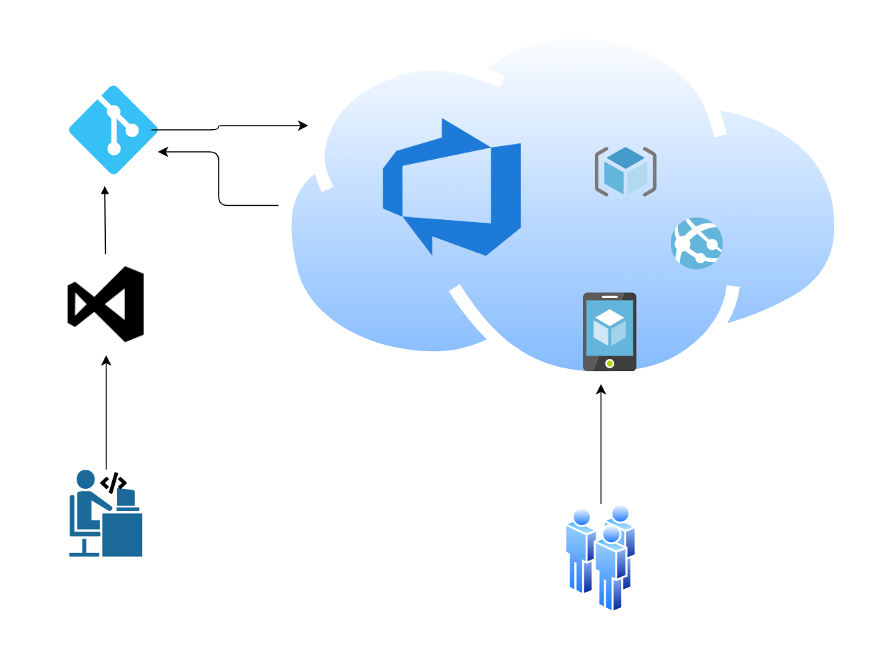
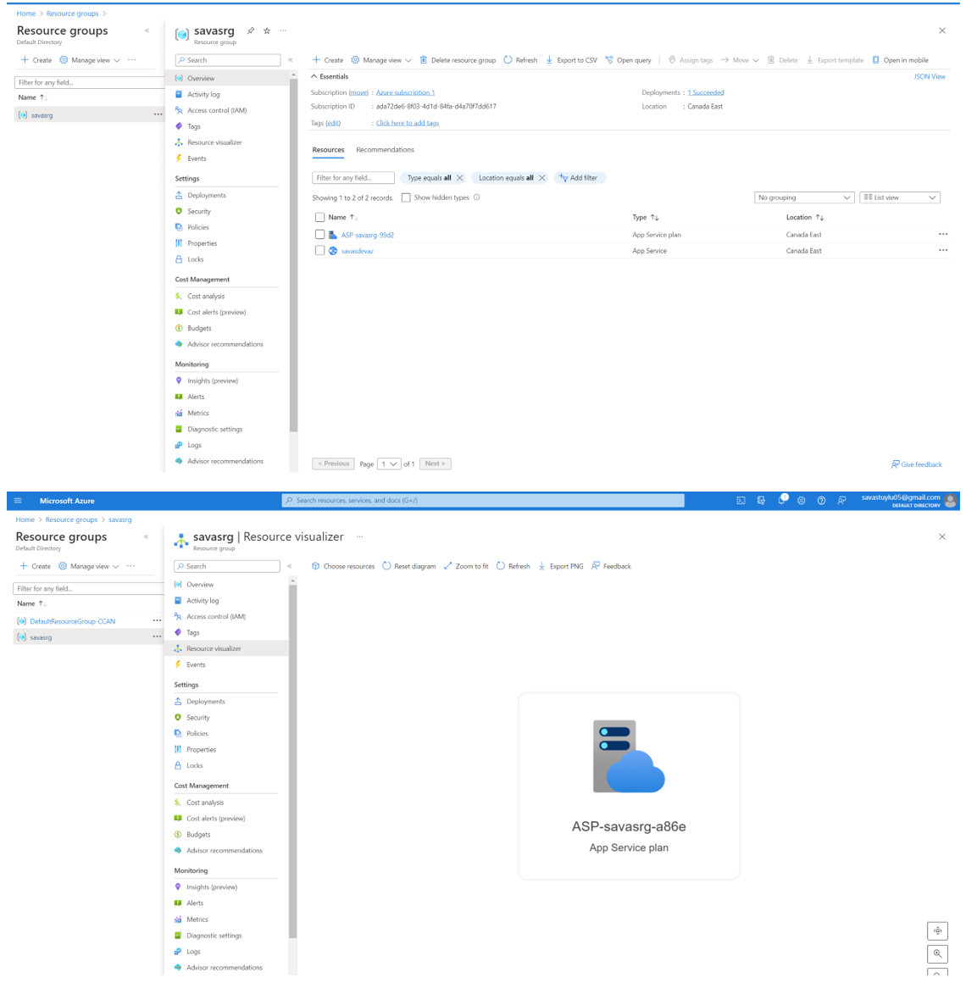
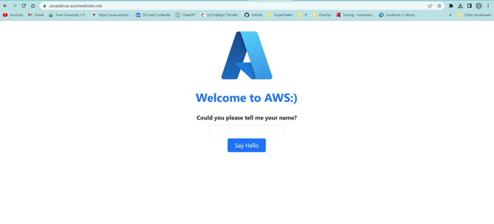

# Deploying Web Application to Azure Application Service - Azure DevOps (CI/CD)

This is Python (Flask) web app to Azure App Service and using Azure DevOps(CI/CD).

First, create an Azure App Service for your web app. This will provide a hosting environment for your app on the Azure platform.

Next, create a new Azure DevOps project and set up a Git repository for your code. This will allow you to use Azure DevOps for continuous integration and deployment of the web app.## In your local development environment, set up a virtual environment and install the necessary dependencies for your web app, including Flask and any other required packages. Commit your code to the Git repository and push it to Azure DevOps. In Azure DevOps, create a new pipeline for your web app. You will use this pipeline to build and test your app, and then deploy it to the Azure App Service. In the pipeline, add tasks to build and test your web app. You can use Azure DevOps built-in tasks for this or use a third-party task to run your test. Next, add a task to deploy your web app to the Azure App Service. This task will use the Azure CLI to deploy your app to the service.

Finally, configure your pipeline to run automatically when changes are pushed to the Git repository. This will enable continuous integration and deployment for your web app. Test the pipeline by making changes to your code and pushing them to the Git repository, and verify that the pipeline runs and deploys your web app to the Azure App Service.

